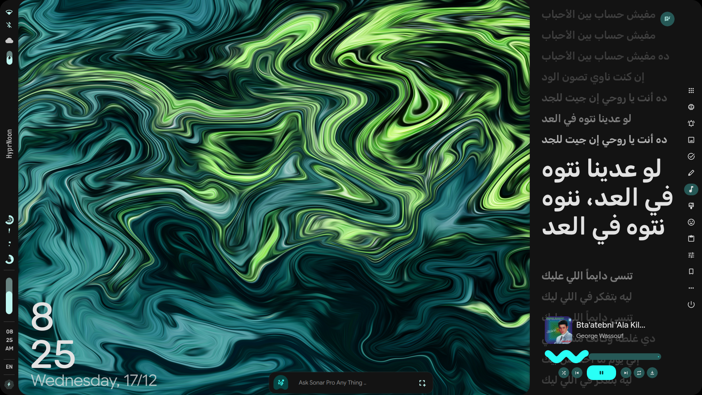
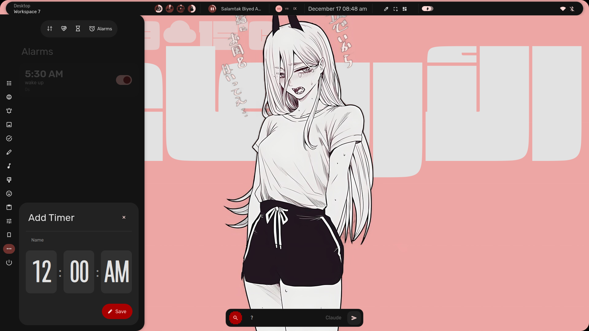

<p align="center">
  
</p>

<h1 align="center">NOON</h1>

### PharmaRacist Prespictive of a Hyprland desktop  

- built on end4-ii dots
- quickshell
- hyprland ofc

### Installation
- You Can install it through git if you want to modify code
```bash
  git clone --depth 1 --single-branch --branch main https://github.com/pharmaracist/Noon ~/.cache/Noon && cd ~/.cache/Noon && ./setup.sh install
```
 - - -
- Or from the Noon_Repo
You can add Noon_Repo by 

```
echo -e "\n[Noon_Repo]\nSigLevel = Optional TrustAll\nServer = https://pharmaracist.github.io/Noon_Repo/\$arch" | sudo tee -a /etc/pacman.conf

```
## Some Screenshots

 
 


## Im too lazy to list the capabilities, So u will figure it out :)
# Enjoy <3
